# Architecture

This document outlines the architecture for the language agnostic AI client specification. It is critical that it meets all [requirements](./REQUIREMENTS.md).

**Note:** As the primary focus for this specification is to facilitate AI usage in PHP, some of the underlying syntax used in this documentation may use PHP conventions. This does not hinder interoperability with other programming languages. Only PHP language capabilities that can be easily replicated in other relevant programming languages will be used.

## High-level API design

The API design at a high level is heavily inspired by the [Vercel AI SDK](https://github.com/vercel/ai), which is widely used in the NodeJS ecosystem and one of the very few comprehensive AI client SDKs available.

The main additional aspect that the Vercel AI SDK does not cater for easily is for a developer to use AI in a way that the choice of provider remains with the user. To clarify with an example: Instead of "Generate text with Google's model `gemini-2.5-flash`", go with "Generate text using any provider model that supports text generation and multimodal input". In other words, there needs to be a mechanism that allows finding any configured model that supports the given set of required AI features and capabilities.

### Code examples

#### Generate text using a Google model

```php
$text = Ai::generateText(
    'Write a 2-verse poem about PHP.',
    Google::model('gemini-2.5-flash')
);
```

#### Generate multiple text candidates using an Anthropic model

```php
$result = Ai::generateTextResult(
    'Write a 2-verse poem about PHP.',
    Anthropic::model(
        'claude-3.7-sonnet',
        ['candidateCount' => 4]
    )
);
$texts = CandidatesUtil::toTexts(
    $result->getCandidates()
);
```

#### Generate an image using any suitable model from any provider

```php
$modelsMetadata = Ai::defaultRegistry()->findModelMetadataForSupport(
    AiFeature::IMAGE_GENERATION
);
$imageFile = Ai::generateImage(
    'Generate an illustration of the PHP elephant in the Carribean sea.',
    Ai::defaultRegistry()->getProviderModel(
        $modelsMetadata[0]['provider']->getId(),
        $modelsMetadata[0]['model']->getId()
    )
);
```

## Class diagrams

This section shows comprehensive class diagrams for the proposed architecture. For explanation on specific terms, see the [glossary](./GLOSSARY.md).

### Full class diagram [WIP, mostly missing feature and capability detection]

```mermaid
---
config:
  class:
    hideEmptyMembersBox: true
---
classDiagram
direction LR
    namespace Ai {
        class AiEntrypoint {
            +defaultRegistry() AiProviderRegistry
            +isConfigured(AiProviderAvailability $availability) bool$
            +generateText(string|MessagePart|MessagePart[]|Message|Message[] $prompt, AiModel $model) string$
            +streamGenerateText(string|MessagePart|MessagePart[]|Message|Message[] $prompt, AiModel $model) Generator< string >$
            +generateImage(string|MessagePart|MessagePart[]|Message|Message[] $prompt, AiModel $model) File$
            +textToSpeech(string|MessagePart|MessagePart[]|Message|Message[] $prompt, AiModel $model) File$
            +generateSpeech(string|MessagePart|MessagePart[]|Message|Message[] $prompt, AiModel $model) File$
            +generateResult(string|MessagePart|MessagePart[]|Message|Message[] $prompt, AiModel $model) GenerativeAiResult$
            +generateOperation(string|MessagePart|MessagePart[]|Message|Message[] $prompt, AiModel $model) GenerativeAiOperation$
            +generateTextResult(string|MessagePart|MessagePart[]|Message|Message[] $prompt, AiModel $model) GenerativeAiResult$
            +streamGenerateTextResult(string|MessagePart|MessagePart[]|Message|Message[] $prompt, AiModel $model) Generator< GenerativeAiResult >$
            +generateImageResult(string|MessagePart|MessagePart[]|Message|Message[] $prompt, AiModel $model) GenerativeAiResult$
            +textToSpeechResult(string|MessagePart|MessagePart[]|Message|Message[] $prompt, AiModel $model) GenerativeAiResult$
            +generateSpeechResult(string|MessagePart|MessagePart[]|Message|Message[] $prompt, AiModel $model) GenerativeAiResult$
            +generateTextOperation(string|MessagePart|MessagePart[]|Message|Message[] $prompt, AiModel $model) GenerativeAiOperation$
            +generateImageOperation(string|MessagePart|MessagePart[]|Message|Message[] $prompt, AiModel $model) GenerativeAiOperation$
            +textToSpeechOperation(string|MessagePart|MessagePart[]|Message|Message[] $prompt, AiModel $model) GenerativeAiOperation$
            +generateSpeechOperation(string|MessagePart|MessagePart[]|Message|Message[] $prompt, AiModel $model) GenerativeAiOperation$
        }
    }
    namespace Ai.Types {
        class Message {
            +getRole() MessageRole
            +getParts() MessagePart[]
        }
        class MessagePart {
            +getType() MessagePartType
            +getText() string
            +getInlineFile() InlineFile
            +getRemoteFile() RemoteFile
            +getFunctionCall() FunctionCall
            +getFunctionResponse() FunctionResponse
        }
        class File {
        }
        class InlineFile {
            +getMimeType() string
            +getBase64Data() string
        }
        class RemoteFile {
            +getMimeType() string
            +getUrl() string
        }
        class LocalFile {
            +getMimeType() string
            +getPath() string
        }
        class FunctionCall {
            +getId() string
            +getName() string
            +getArgs() array&lt; string, mixed &gt;
        }
        class FunctionResponse {
            +getId() string
            +getName() string
            +getResponse() mixed
        }
        class Operation {
            +getId() string
            +getState() OperationState
        }
        class GenerativeAiOperation {
            +getId() string
            +getState() OperationState
            +getResult() GenerativeAiResult
        }
        class GenerativeAiResult {
            +getId() string
            +getCandidates() Candidate[]
            +getUsage() TokenUsage
        }
        class Candidate {
            +getMessage() Message
            +getFinishReason() FinishReason
            +getTokenCount() int
        }
        class TokenUsage {
            +getPromptTokens() int
            +getCompletionTokens() int
            +getTotalTokens() int
        }
    }
    namespace Ai.Types.Enums {
        class MessageRole {
            USER
            MODEL
            SYSTEM
        }
        class MessagePartType {
            TEXT
            INLINE_FILE
            REMOTE_FILE
            FUNCTION_CALL
            FUNCTION_RESPONSE
        }
        class FinishReason {
            STOP
            LENGTH
            CONTENT_FILTER
            TOOL_CALLS
            ERROR
        }
        class OperationState {
            STARTING
            PROCESSING
            SUCCEEDED
            FAILED
            CANCELED
        }
        class AiModality {
            TEXT
            IMAGE
            AUDIO
            VIDEO
        }
    }
    namespace Ai.Util {
        class MessageUtil {
            +toText(Message $message) string$
            +toImageFile(Message $message) File$
            +toAudioFile(Message $message) File$
            +toVideoFile(Message $message) File$
        }
        class CandidatesUtil {
            +toTexts(Candidate[] $candidates) string[]$
            +toImageFiles(Candidate[] $candidates) File[]$
            +toAudioFiles(Candidate[] $candidates) File[]$
            +toVideoFiles(Candidate[] $candidates) File[]$
            +toFirstText(Candidate[] $candidates) string$
            +toFirstImageFile(Candidate[] $candidates) File$
            +toFirstAudioFile(Candidate[] $candidates) File$
            +toFirstVideoFile(Candidate[] $candidates) File$
        }
    }
    namespace Ai.Providers {
        class AiProviderRegistry {
            +registerProvider(string $className) void
            +hasProvider(string $idOrClassName) bool
            +getProviderClassName(string $id) string
            +isProviderConfigured(string $idOrClassName) bool
            +getProviderModel(string $idOrClassName, string $modelId, AiModelConfig|array $modelConfig) AiModel
        }
    }
    namespace Ai.Providers.Contracts {
        class AiProvider {
            +metadata() AiProviderMetadata$
            +model(string $modelId, AiModelConfig|array< string, mixed > $modelConfig) AiModel$
            +availability() AiProviderAvailability$
            +modelMetadataDirectory() AiModelMetadataDirectory$
        }
        class AiModel {
            +metadata() AiModelMetadata
            +setConfig(AiModelConfig $config) void
            +getConfig() AiModelConfig
        }
        class AiProviderAvailability {
            +isConfigured() bool
        }
        class AiModelMetadataDirectory {
            +listModelMetadata() AiModelMetadata[]
            +hasModelMetadata(string $modelId) bool
            +getModelMetadata(string $modelId) AiModelMetadata
        }
        class WithHttpClient {
            +setHttpClient(HttpClient $client) void
            +getHttpClient() HttpClient
        }
        class WithGenerativeAiOperations {
            +getOperation(string $operationId) GenerativeAiOperation
        }
        class AiTextGenerationModel {
            +generateTextResult(Message[] $prompt) GenerativeAiResult
            +streamGenerateTextResult(Message[] $prompt) Generator< GenerativeAiResult >
        }
        class AiImageGenerationModel {
            +generateImageResult(Message[] $prompt) GenerativeAiResult
        }
        class AiTextToSpeechModel {
            +textToSpeechResult(Message[] $prompt) GenerativeAiResult
        }
        class AiSpeechGenerationModel {
            +generateSpeechResult(Message[] $prompt) GenerativeAiResult
        }
        class AiTextGenerationOperationModel {
            +generateTextOperation(Message[] $prompt) GenerativeAiOperation
        }
        class AiImageGenerationOperationModel {
            +generateImageOperation(Message[] $prompt) GenerativeAiOperation
        }
        class AiTextToSpeechOperationModel {
            +textToSpeechOperation(Message[] $prompt) GenerativeAiOperation
        }
        class AiSpeechGenerationOperationModel {
            +generateSpeechOperation(Message[] $prompt) GenerativeAiOperation
        }
    }
    namespace Ai.Providers.Types {
        class AiProviderMetadata {
            +getId() string
            +getName() string
            +getType() AiProviderType
        }
        class AiModelMetadata {
            +getId() string
            +getName() string
        }
        class AiModelConfig {
            +setSystemInstruction(string|MessagePart|MessagePart[]|Message $systemInstruction) void
            +getSystemInstruction() Message?
            +setTextGenerationConfig(TextGenerationConfig $config) void
            +getTextGenerationConfig() TextGenerationConfig?
            +setImageGenerationConfig(ImageGenerationConfig $config) void
            +getImageGenerationConfig() ImageGenerationConfig?
            +setTextToSpeechConfig(TextToSpeechConfig $config) void
            +getTextToSpeechConfig() TextToSpeechConfig?
            +setSpeechGenerationConfig(SpeechGenerationConfig $config) void
            +getSpeechGenerationConfig() SpeechGenerationConfig?
        }
    }
    namespace Ai.Providers.Enums {
        class AiFeature {
            TEXT_GENERATION
            IMAGE_GENERATION
            TEXT_TO_SPEECH
            SPEECH_GENERATION
            MUSIC_GENERATION
            VIDEO_GENERATION
            EMBEDDING
        }
        class AiProviderType {
            CLOUD
            SERVER
            CLIENT
        }
    }

    %% Annotations for Ai namespaces, except Ai.Providers.*.
    <<interface>> File
    <<interface>> Operation
    <<Enumeration>> MessageRole
    <<Enumeration>> MessagePartType
    <<Enumeration>> FinishReason
    <<Enumeration>> OperationState
    <<Enumeration>> AiModality

    AiEntrypoint .. AiProviderRegistry : creates
    AiEntrypoint .. Message : receives
    AiEntrypoint .. MessagePart : receives
    AiEntrypoint .. GenerativeAiResult : creates
    AiEntrypoint .. GenerativeAiOperation : creates
    Message "1" *-- "1..*" MessagePart
    MessagePart "1" o-- "0..1" InlineFile
    MessagePart "1" o-- "0..1" RemoteFile
    MessagePart "1" o-- "0..1" FunctionCall
    MessagePart "1" o-- "0..1" FunctionResponse
    GenerativeAiOperation "1" o-- "0..1" GenerativeAiResult
    GenerativeAiResult "1" o-- "1..*" Candidate
    GenerativeAiResult "1" o-- "1" TokenUsage
    Candidate "1" o-- "1" Message
    Message ..> MessageRole
    MessagePart ..> MessagePartType
    Operation ..> OperationState
    GenerativeAiOperation ..> OperationState
    Candidate ..> FinishReason
    File <|-- InlineFile
    File <|-- RemoteFile
    File <|-- LocalFile
    Operation <|-- GenerativeAiOperation

    %% Annotations for Ai.Providers.* namespaces.
    <<interface>> AiProvider
    <<interface>> AiModel
    <<interface>> AiProviderAvailability
    <<interface>> AiModelMetadataDirectory
    <<interface>> WithHttpClient
    <<interface>> WithGenerativeAiOperations
    <<interface>> AiTextGenerationModel
    <<interface>> AiImageGenerationModel
    <<interface>> AiTextToSpeechModel
    <<interface>> AiSpeechGenerationModel
    <<interface>> AiTextGenerationOperationModel
    <<interface>> AiImageGenerationOperationModel
    <<interface>> AiTextToSpeechOperationModel
    <<interface>> AiSpeechGenerationOperationModel
    <<Enumeration>> AiFeature
    <<Enumeration>> AiProviderType

    AiProvider .. AiModel : creates
    AiProvider "1" *-- "1" AiProviderMetadata
    AiProvider "1" *-- "1" AiProviderAvailability
    AiProvider "1" *-- "1" AiModelMetadataDirectory
    AiModel "1" *-- "1" AiModelMetadata
    AiModel "1" *-- "1" AiModelConfig
    AiProviderRegistry "1" o-- "0..*" AiProvider
    AiProviderRegistry "1" o-- "0..*" AiProviderMetadata
    AiModelMetadataDirectory "1" o-- "1..*" AiModelMetadata
    AiProviderMetadata ..> AiProviderType
    AiModel <|-- AiTextGenerationModel
    AiModel <|-- AiImageGenerationModel
    AiModel <|-- AiTextToSpeechModel
    AiModel <|-- AiSpeechGenerationModel
    AiModel <|-- AiTextGenerationOperationModel
    AiModel <|-- AiImageGenerationOperationModel
    AiModel <|-- AiTextToSpeechOperationModel
    AiModel <|-- AiSpeechGenerationOperationModel
    WithGenerativeAiOperations <|-- AiTextGenerationOperationModel
    WithGenerativeAiOperations <|-- AiImageGenerationOperationModel
    WithGenerativeAiOperations <|-- AiTextToSpeechOperationModel
    WithGenerativeAiOperations <|-- AiSpeechGenerationOperation
```



### Class diagram zoomed in on AI usage ONLY

TODO.

### Class diagram zoomed in on AI provider registration and implementation ONLY

TODO.
